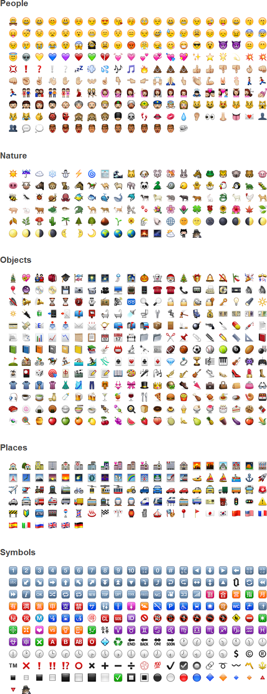

# [][project]

[][project] [][issues] [](LICENSE "License") <span style="float:right;">[][flattr] [][paypal]</span>

> Emoji is the ultimate collection of smileys and emoticons from [Emoji Cheat Sheet](http://www.emoji-cheat-sheet.com) for [Grav](http://getgrav.org).

## About

`Emoji` is the ultimate of collection smileys and emoticons used for various famous applications like [Github](https://github.com/) made available via the [Emoji Cheat Sheet project](https://github.com/arvida/emoji-cheat-sheet.com). It includes more than 880 smileys and emotiocns, each one having its own textual representation as can been seen in the official [Emoji Cheat Sheet](http://www.emoji-cheat-sheet.com).



## Installation

To install this data pack, just download the zip version of this repository and unzip it under `user/data/smileys`. Then, rename the folder to `emoji`.

You should now have all the data pack files under

	user/data/smileys/emoji

>> NOTE: This data pack is a modular component for Grav Smileys Plugin which requires [Grav](http://github.com/getgrav/grav), [Grav Smileys Plugin](https://github.com/sommerregen/grav-plugin-smileys) and a theme to be installed in order to operate.

## Usage

To activate and use `Emoji` the best process is to copy the [smileys.yaml](https://github.com/sommerregen/grav-plugin-smileys/smileys.yaml) file from the [Grav Smileys Plugin](https://github.com/sommerregen/grav-plugin-smileys) into your `users/config/plugins/` folder (create it if it doesn't exist), and  set the smileys package option to

```yaml
pack: emoji
```

You can then use any of the below smiley acronyms in your pages and `Grav Smileys Plugin` will automatically convert them to their icon graphic file equivalent. As an example

```
I love you :heart:
```

will then transform to

<code>I love you :heart:</code>

### Contents

By default `Emoji` supports all smileys from the [Emoji cheat sheet](http://www.emoji-cheat-sheet.com/) (e.g. :heart: and :smiley:). It comes [pre-configured](emoji.yaml) with each smiley entry having the format

```yaml
<your-smiley-file-without-extension>:
  enabled: true | false
  acronyms: "<your space separated acronyms e.g. :-) :)>"
  description: "<your description>"
```

In other words, smilies can be disabled separately by setting `enabled: false` or modified by setting your own description and/or smiley acronyms.

## Contributing

You can contribute at any time! Before opening any issue, please search for existing issues and review the [guidelines for contributing](CONTRIBUTING.md).

After that please note:

* If you find a bug, would like to make a feature request or suggest an improvement, [please open a new issue][issues]. If you have any interesting ideas for additions to the syntax please do suggest them as well!
* Feature requests are more likely to get attention if you include a clearly described use case.
* If you wish to submit a pull request, please make again sure that your request match the [guidelines for contributing](CONTRIBUTING.md) and that you keep track of adding unit tests for any new or changed functionality.

> If you directly want to contribute an addition to Emoji, be it a new smiley/emoticon or a package for an IM client, please open an issue on the original page https://github.com/arvida/emoji-cheat-sheet.com

### Support and donations

If you like my project, feel free to support me via [][flattr] or by sending me some bitcoins to [**1HQdy5aBzNKNvqspiLvcmzigCq7doGfLM4**][bitcoin].

Thanks!

## License

Copyright (c) 2015 [Benjamin Regler][github]. See also the list of [contributors] who participated in this project.

1. **Grav Smileys Data Pack - Emoji** is [dual-licensed](LICENSE) for use under the terms of the [MIT][mit-license] or [GPLv3][gpl-license] licenses.

    ![GNU license - Some rights reserved][gnu]

2. **Emoji** (https://github.com/arvida/emoji-cheat-sheet.com) is licensed by their respective owners:
	- *octocat, squirrel, shipit* -- Copyright (c) 2012 GitHub Inc. All rights reserved.
	- *bowtie* -- Copyright (c) 2012 37signals, LLC. All rights reserved.
	- *neckbeard* -- Copyright (c) 2012 Jamie Dihiansan. Creative Commons Attribution 3.0 Unported
	- *feelsgood, finnadie, goberserk, godmode, hurtrealbad, rage 1-4, suspect* -- Copyright (c) 2012 id Software. All rights reserved.
	- *trollface* -- Copyright (c) 2012 whynne@deviantart. All rights reserved.
	- *All other emoji images* -- Copyright (c) 2012 Apple Inc. All rights reserved.

[github]: https://github.com/sommerregen/ "GitHub account from Benjamin Regler"
[gpl-license]: http://opensource.org/licenses/GPL-3.0 "GPLv3 license"
[mit-license]: http://www.opensource.org/licenses/mit-license.php "MIT license"

[flattr]: https://flattr.com/submit/auto?user_id=Sommerregen&url=https://github.com/sommerregen/grav-data-smileys-emoji "Flatter my GitHub project"
[paypal]: https://www.paypal.com/cgi-bin/webscr?cmd=_s-xclick&hosted_button_id=SYFNP82USG3RN "Donate for my GitHub project using PayPal"
[bitcoin]: bitcoin:1HQdy5aBzNKNvqspiLvcmzigCq7doGfLM4?label=GitHub%20project "Donate for my GitHub project using BitCoin"
[gnu]: https://upload.wikimedia.org/wikipedia/commons/thumb/3/33/License_icon-gpl-88x31.svg/88px-License_icon-gpl-88x31.svg.png "GNU license - Some rights reserved"

[project]: https://github.com/sommerregen/grav-data-smileys-emoji
[issues]: https://github.com/sommerregen/grav-data-smileys-emoji/issues "GitHub Issues for Grav Smileys Data Pack -- Emoji"
[contributors]: https://github.com/sommerregen/grav-data-smileys-emoji/graphs/contributors "List of contributors of the project"

[emoji]: https://github.com/arvida/emoji-cheat-sheet.com
